# 🔮 Autolysis: AI-Powered Data Storytelling

<div align="center">


**Transform raw data into compelling narratives with a single command** ✨

*Autolysis automatically analyzes, visualizes, and narrates the story hidden in your datasets*

</div>

---

## 🎯 What is Autolysis?

Imagine having a data scientist in your terminal who works 24/7, never gets tired, and delivers insights in seconds. That's **Autolysis**.

Drop in your CSV file, and watch as Autolysis:
- 🔍 **Discovers** patterns and anomalies
- 📊 **Visualizes** relationships and distributions  
- 📝 **Narrates** findings in plain English
- 🎨 **Creates** publication-ready charts

No configuration. No coding. Just insights.

---

## ✨ Features

<table>
<tr>
<td width="50%">

### 🧠 Intelligent Analysis
```
✓ Auto-detects data types
✓ Handles missing values
✓ Computes correlations
✓ Identifies outliers (IQR method)
✓ Statistical summaries
```

</td>
<td width="50%">

### 🎨 Beautiful Visualizations
```
✓ Correlation heatmaps
✓ Distribution plots with KDE
✓ Outlier bar charts
✓ Color-coded insights
✓ High-resolution exports
```

</td>
</tr>
</table>

### 🚀 Zero Configuration Required

```bash
python autolysis.py your_data.csv
```

That's it. Seriously.

---

## 📂 Project Structure

```
autolysis/
│
├── 🐍 autolysis.py          # The magic happens here
├── ⚙️  proxy.env             # Environment configuration
├── 📜 LICENSE                # MIT License
│
├── 📚 goodreads/             
│   ├── README.md
│   ├── correlation_matrix.png
│   ├── outliers.png
│   └── distribution.png
│
├── 😊 happiness/             
│   ├── README.md
│   ├── correlation_matrix.png
│   ├── outliers.png
│   └── distribution.png
│
└── 🎬 media/                
    ├── README.md
    ├── correlation_matrix.png
    ├── outliers.png
    └── distribution.png
```

---

## 🚀 Quick Start

### Prerequisites

```bash
python >= 3.9
```

### Installation

```bash
# Clone the repository
git clone <your-repo-url>
cd autolysis

# Install dependencies
pip install pandas seaborn matplotlib numpy scipy openai scikit-learn requests ipykernel
```

### Run Your First Analysis

```bash
python autolysis.py data/my_dataset.csv
```

### What You Get

```
output/
├── 📊 correlation_matrix.png    # See how variables relate
├── 🎯 outliers.png              # Spot the anomalies
├── 📈 distribution.png          # Understand your data shape
└── 📝 README.md                 # Complete analysis report
```

---

## 🎭 Live Examples

### 📚 Goodreads Analysis
**Dataset**: 10,000+ books with ratings, reviews, and metadata

**Key Insights Discovered**:
- Strong correlation between rating counts and text reviews
- Outlier detection revealed controversial bestsellers
- Distribution analysis showed rating bias patterns

[View Full Analysis →](goodreads/README.md)

---

### 😊 Happiness Analysis  
**Dataset**: Global happiness metrics across 150+ countries

**Key Insights Discovered**:
- GDP and life expectancy show strong positive correlation
- Social support emerges as critical happiness factor
- Regional clustering patterns identified

[View Full Analysis →](happiness/README.md)

---

### 🎬 Media Analysis
**Dataset**: Media ratings, engagement, and user interactions

**Key Insights Discovered**:
- Engagement spikes correlate with specific content types
- User retention patterns reveal optimal posting times
- Platform-specific audience behavior differences

[View Full Analysis →](media/README.md)

---

## 🔬 How It Works

```mermaid
graph LR
    A[📁 CSV Input] --> B[🔍 Data Loading]
    B --> C[🧮 Type Detection]
    C --> D[📊 Statistical Analysis]
    D --> E[🎯 Outlier Detection]
    E --> F[🎨 Visualization]
    F --> G[📝 Report Generation]
    G --> H[✅ Output Directory]
    
    style A fill:#e1f5ff
    style H fill:#d4edda
```

<div align="center">



</div>

### The Pipeline

| Step | What Happens | Output |
|------|-------------|--------|
| **1. Ingestion** | Loads CSV with smart encoding detection | DataFrame ready for analysis |
| **2. Profiling** | Separates numeric/categorical data | Type-specific summaries |
| **3. Analysis** | Computes stats, correlations, missing data | Statistical insights |
| **4. Outlier Detection** | IQR method identifies anomalies | Outlier counts per column |
| **5. Visualization** | Creates 3 publication-ready charts | PNG files |
| **6. Documentation** | Generates comprehensive markdown report | README.md |

---

## 🎨 Visualization Gallery

<table>
<tr>
<td width="33%">

### Correlation Matrix


*Discover hidden relationships between variables*

</td>
<td width="33%">

### Outlier Detection


*Identify anomalies that need attention*

</td>
<td width="33%">

### Distribution Analysis


*Understand your data's shape and spread*

</td>
</tr>
</table>

---

## 🛠️ Advanced Usage

### Custom Output Directory

```python
# Modify in autolysis.py
output_dir = "my_custom_output"
os.makedirs(output_dir, exist_ok=True)
```

### Batch Processing

```bash
# Analyze multiple datasets
for file in data/*.csv; do
    python autolysis.py "$file"
done
```

### Environment Configuration

Edit `proxy.env` to customize:

```bash
# API Configuration
OPENAI_API_KEY=your_key_here

# Proxy Settings
HTTP_PROXY=http://proxy.example.com:8080
HTTPS_PROXY=https://proxy.example.com:8080

# Output Settings
OUTPUT_DIR=./custom_output
```

---

## 🧩 Core Functions

<details>
<summary><b>🔍 handle_data_types(df)</b></summary>

```python
# Intelligently separates numeric and categorical data
# Returns: numeric_summary, categorical_summary, correlation_matrix
```
</details>

<details>
<summary><b>📊 perform_analysis(df)</b></summary>

```python
# Comprehensive statistical analysis
# Returns: summaries, missing_data, correlations
```
</details>

<details>
<summary><b>🎯 find_outliers(df)</b></summary>

```python
# IQR-based outlier detection
# Returns: outlier_counts per column
```
</details>

<details>
<summary><b>🎨 generate_visualizations(...)</b></summary>

```python
# Creates correlation heatmap, outlier chart, distribution plot
# Returns: file paths to generated images
```
</details>

<details>
<summary><b>📝 write_readme(...)</b></summary>

```python
# Generates comprehensive markdown report
# Returns: README.md with all findings
```
</details>

---

## 📊 Sample Output

```markdown
# Dataset Analysis Report

## Summary Statistics
- **Total Rows**: 10,000
- **Total Columns**: 23
- **Missing Values**: 156 (0.7%)
- **Numeric Columns**: 15
- **Categorical Columns**: 8

## Key Findings
✓ Strong correlation (0.89) between variables X and Y
✓ 47 outliers detected in 'revenue' column
✓ Normal distribution observed in 'age' variable
✓ No critical missing data patterns

## Visualizations
📊 correlation_matrix.png - Explore variable relationships
🎯 outliers.png - Anomaly detection results
📈 distribution.png - Primary variable distribution
```


## 🐛 Troubleshooting

<details>
<summary><b>Error: "No module named 'pandas'"</b></summary>

```bash
pip install pandas seaborn matplotlib numpy scipy
```
</details>

<details>
<summary><b>Error: "UnicodeDecodeError"</b></summary>

The script uses ISO-8859-1 encoding. For UTF-8 files, modify line 134:

```python
df = pd.read_csv(input_file, encoding='utf-8')
```
</details>

<details>
<summary><b>No visualizations generated</b></summary>

Ensure your dataset has numeric columns. The script requires at least one numeric column for full functionality.
</details>

---

## 📜 License

This project is licensed under the MIT License - see the [LICENSE](LICENSE) file for details.

---

## 🙏 Acknowledgments

- **Pandas** - For making data manipulation delightful
- **Seaborn** - For beautiful statistical visualizations
- **Matplotlib** - For the foundation of Python plotting
- **The Open Source Community** - For continuous inspiration

---


Made with ❤️ and ☕ by data enthusiasts, for data enthusiasts

**[⬆ back to top](#-autolysis-ai-powered-data-storytelling)**

</div>
